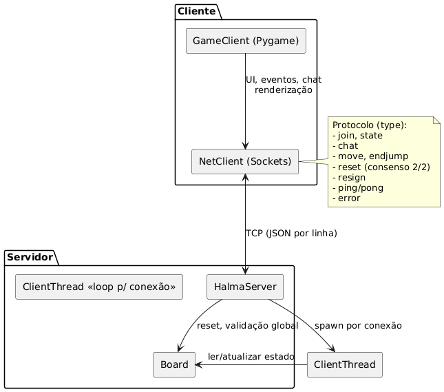
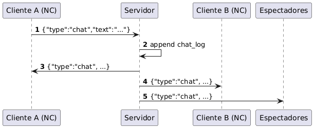
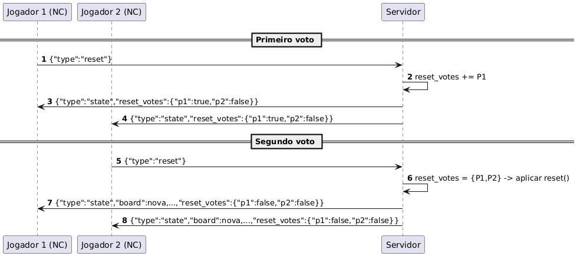
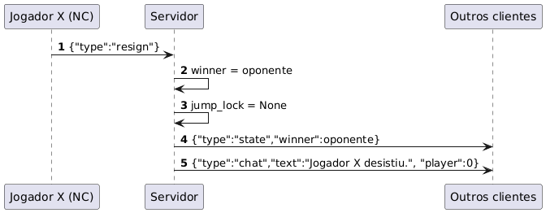
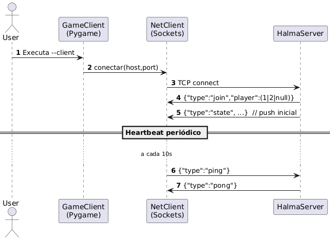
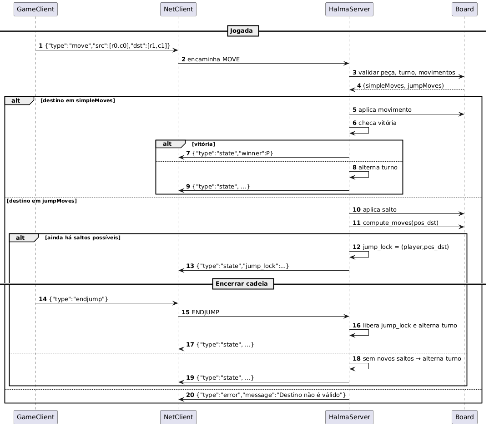
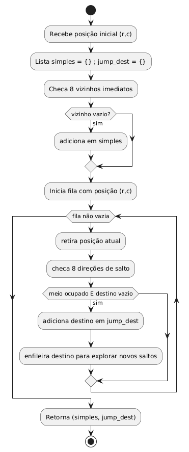

# 📖 Protocolo de Comunicação

## 🔑 Estrutura geral



Cada mensagem é um **JSON** com pelo menos a chave `"type"`.
Exemplo:

```json
{"type": "chat", "text": "Olá!"}
```

* **Codificação**: UTF-8
* **Delimitador**: `\n` (uma linha por mensagem)
* **Formatação**: `json.dumps(..., separators=(",", ":"))`

---

## ⬅️ Mensagens do servidor → cliente

### 🔹 1. Conexão inicial

* **join**

  ```json
  {"type": "join", "player": 1}
  ```

  → informa se você é **Jogador 1**, **Jogador 2** ou **espectador** (`null`).

* **state**

  ```json
  {
    "type": "state",
    "board": [[...16 colunas...], ...16 linhas...],
    "turn": 1,
    "winner": null,
    "chat": [{"player":1,"text":"oi"}],
    "players": {"p1":true,"p2":false},
    "jump_lock": {"player":1,"pos":[2,3]},
    "reset_votes": {"p1":false,"p2":true}
  }
  ```

  → snapshot completo do jogo: tabuleiro, turno, vencedor, chat, jogadores online, etc.

### 🔹 2. Eventos contínuos

* **chat**

  ```json
  {"type":"chat","player":2,"text":"bom jogo!"}
  ```

* **error**

  ```json
  {"type":"error","message":"Destino não é válido"}
  ```

* **pong** (resposta ao ping do cliente)

---

## ➡️ Mensagens do cliente → servidor

* **chat**

  

  ```json
  {"type":"chat","text":"minha mensagem"}
  ```

* **move**

  ```json
  {"type":"move","src":[2,3],"dst":[3,4]}
  ```

* **endjump** (encerra cadeia de saltos)

  ```json
  {"type":"endjump"}
  ```

* **reset** (voto para reiniciar a partida; só reinicia se os dois votarem)

  

  ```json
  {"type":"reset"}
  ```

* **resign** (desistência)

  

  ```json
  {"type":"resign"}
  ```

* **ping** (heartbeat automático a cada 10s)

  

  ```json
  {"type":"ping"}
  ```

---

## 🔄 Cadeia de saltos (jump-lock)



* No Halma, uma peça pode **saltar sobre peças vizinhas** para casas vazias.
* Após um salto, se houver outro salto possível com a mesma peça, o jogador pode continuar.
* Esse encadeamento chama-se **jump-lock** no código: o turno “trava” na mesma peça até o jogador encerrar.

---

## ⚙️ Regras do servidor para saltos

1. Jogador faz um salto válido → servidor move a peça.
2. Servidor verifica com `compute_moves`:

   * se ainda há saltos possíveis → ativa o **jump\_lock**.
   * turno não passa ao adversário.
3. Enquanto ativo:

   * jogador só pode mover **essa mesma peça**,
   * apenas com saltos (movimentos simples não são aceitos).
4. Jogador pode encerrar manualmente com **ENDJUMP** (tecla **Espaço**).
5. Quando não há mais saltos ou jogador encerra:

   * **jump\_lock** é liberado,
   * turno passa para o adversário.



---

## 🧩 Resumo em etapas do `compute_moves`

* Checa **vizinhos imediatos** → gera **movimentos simples**.
* Explora **saltos sobre peças** via BFS → gera destinos múltiplos.
* Retorna ambos conjuntos, permitindo ao jogo saber:

  * se há movimentos simples,
  * se está em **modo jump-lock** (apenas saltos).
